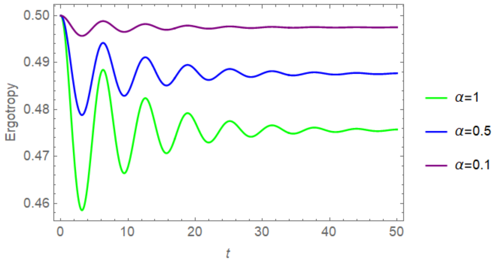
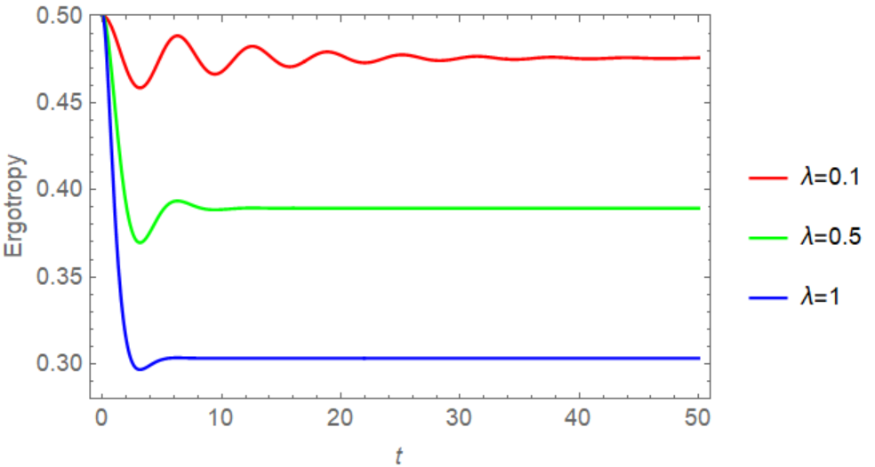
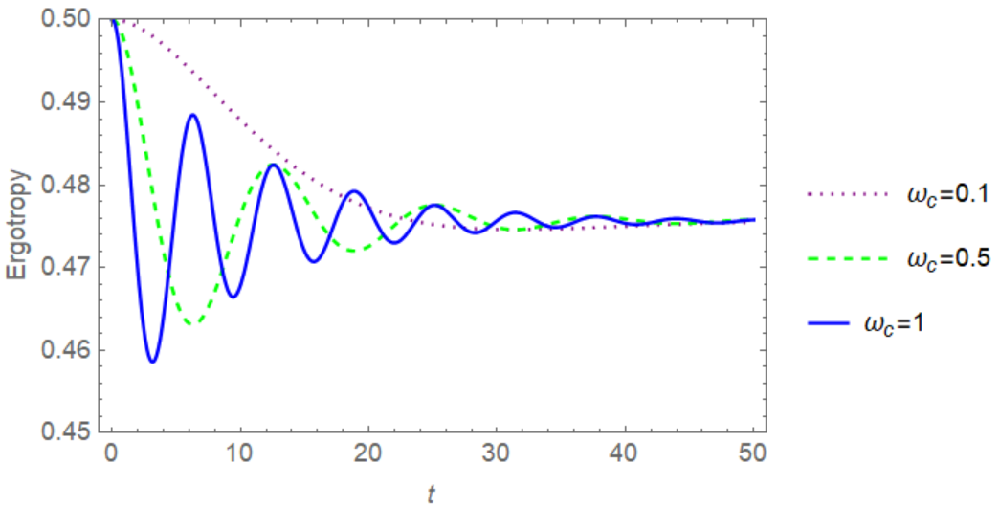
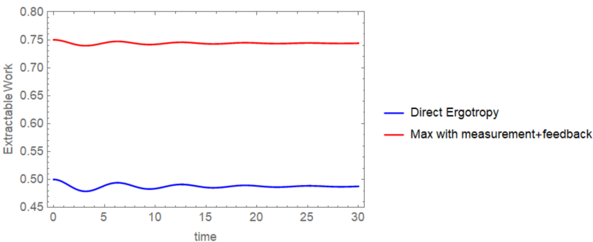
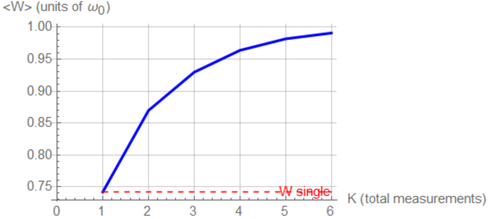
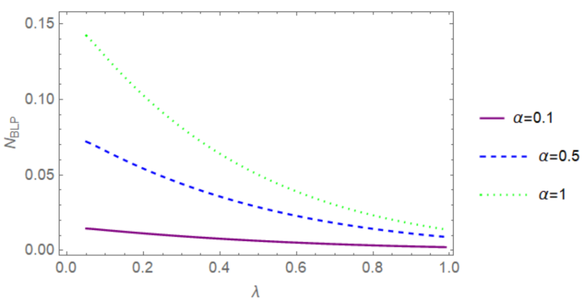
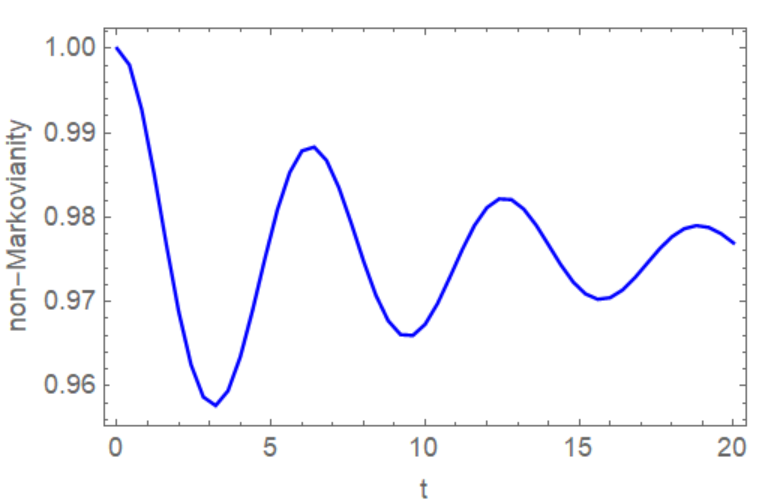
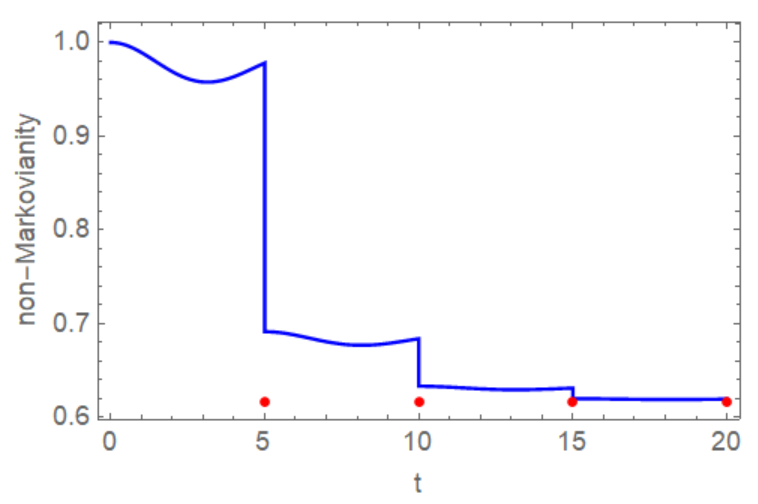

**通过测量与反馈协议提升纯退相位量子电池的可提取功**

Lu Hou^1,2,^[^1], Chaoquan Wang^3^, Yongshun Song^1^

1 常州工业职业技术学院信息工程学院，江苏常州 213164

2 扬州大学物理科学与技术学院，江苏扬州 225009

3 东华理工大学物理系，江西南昌 330000

## 摘要

量子电池是利用量子资源来增强可提取功的能量存储器件。在现实情形中，与环境的相互作用会降低相干性并抑制电池性能，然而，来自非马尔可夫环境的信息回流可以恢复损失的能量。因此，在本文中，我们研究投影测量与反馈如何在非马尔可夫纯退相位环境下提升一个量子比特电池的最大可提取功，即可提取功（ergotropy）。我们推导出单次测量方法的最优测量基，并表明平均功总是超过无测量时的可提取功。将该方法扩展到一系列测量，结果表明可提取功随测量次数单调增长，并表现出由有限环境记忆所支配的边际收益递减式饱和。为了量化所消耗的资源，我们引入了非马尔可夫性，并获得了它与量子电池直接可提取功之间的等量关系。我们的数值结果揭示了在非选择性测量序列控制下有效非马尔可夫性的阶梯状衰减，这与可提取功的增长相对应，并证实非马尔可夫性是一种可消耗的热力学资源。我们的方案在开放量子系统理论与量子热力学之间架起桥梁，并展示了如何将结构化环境与量子测量相结合以实现可控的量子电池。

**关键词：** 量子电池，可提取功，测量方案，非马尔可夫性，纯退相位环境

## 1. 引言

如何从量子器件中高效地储存和提取能量，是量子热力学这一新兴领域中的关键挑战。量子电池（QB）作为一种有限维量子系统，在理解量子电池的基本性质与实际实现方面引起了广泛关注 \[1-10\]。许多研究致力于在各种平台上实验实现量子电池，例如超导量子电路 \[11, 12\]、光子体系 \[13, 14\] 以及囚禁离子 \[15\]。由于量子相干和量子纠缠等真正的量子特性，量子电池在充电功率和可提取功方面优于传统电池 \[1, 16-19\]。更广泛地说，量子电池在其充电、储存和放电循环过程中的性能可以通过多种基于测量的外部技术得到改善。一些研究已经证明，投影测量可以增强量子电池的性能 \[20, 21\]。此外，量子反馈控制策略已被证明是量子电池能量存储的有效方法 \[22, 23\]。也有评估指出，量子最优控制也是改善量子电池的重要方案。当采用收敛的迭代最优方法时，充电过程的功率和效率都能得到显著提高 \[24\]。

另一方面，外部环境会影响量子电池的性质，能量存储和功提取的动力学由相干性与环境效应引起的耗散之间的相互作用所支配。对于马尔可夫动力学的情形，即不考虑来自外部环境的信息回流，一些研究已经探索了开放电池如何被满意地充电并表现出更高的最大可提取功 \[25-27\]。对于具有环境记忆的非马尔可夫动力学，也有许多研究探讨了其对量子电池的影响。例如，Salimi 等人的研究表明，环境的非马尔可夫性可以抑制量子电池中的固有放电过程 \[28\]。对于玻色环境，与马尔可夫动力学相比，在非马尔可夫动力学中量子电池可以被完全充电且其能量可以长期保持 \[29\]。此外，通过调控开放系统的某些参数，可以有效地控制量子电池中的能量提取 \[30-32\]。然而，上述关于量子电池在马尔可夫和非马尔可夫环境中的结果迄今为止都集中在动力学分析上，而对外部测量与反馈控制的探索仍然缺失。尽管已经表明投影测量可以增强许多量子电池模型的可提取功，但如何在连续耗散演化下积极利用环境信息回流来提升电池性能（尤其是在非马尔可夫纯退相位情形下）这一问题尚未得到解决。此外，量子电池的可提取功与系统非马尔可夫性质之间的定量关系也完全未被探索。

在本文中，我们提出了一种对量子比特电池的测量与反馈方案，该电池受到具有洛伦兹谱密度的纯退相位玻色环境的相互作用，这使得我们能够在非马尔可夫区域对退相干动力学进行精确的解析处理。我们推导出使平均可提取功最大化的最优测量基，并揭示即使在相干性几乎消失的情况下，外部测量干预也能带来相对于无测量时可提取功的显著增益。此外，通过在演化过程中插入若干自适应投影测量，我们证明功可以进一步增加，每一次额外的测量都会采集由非马尔可夫信息回流恢复的一部分相干性。平均功被证明随测量次数单调增长，然而其边际收益递减，这反映了环境记忆的有限容量。此外，我们还得到了非马尔可夫性与量子电池直接可提取功之间的等量关系，并且通过采用一系列非选择性测量，我们的数值结果表明随着测量的加入，非马尔可夫性呈现清晰的阶梯状衰减，这与功的增加完美互补，从而证实非马尔可夫性确实是一种被逐步消耗并转化为量子电池可提取能量的资源。

本文结构如下。在第 2 节中，我们介绍纯退相位环境下量子比特电池的模型，并获得动力学的精确解。在第 3 节中，我们推导最优可提取功，即量子电池的可提取功（ergotropy），并研究其随玻色浴参数的变化。我们在第 4 节研究单次最优测量-反馈方案以及测量基的解析优化。此外，我们将该方案扩展到多次测量，并在本节讨论数值结果以及平均可提取功的饱和行为。第 5 节专门讨论非马尔可夫性的特征，用 BLP 度量进行评估。我们研究非选择性测量序列下的有效非马尔可夫性，以及非马尔可夫性与可提取功之间的关系。最后，我们在第 6 节给出结论。

## 2. 量子电池系统模型

我们研究中的量子电池由一个单二能级系统，即一个量子比特构成，其自由哈密顿量为

$H_{s} = \frac{\omega_{0}}{2}\sigma_{z}$ (1)

其中 $\omega_{0} > 0$ 表示储存的能量。量子电池的充电态和未充电态可以描述为泡利算符 $\sigma_{z}$ 的本征态 \[4, 33\]。电池系统与一个玻色库耦合，这可以诱发纯退相位过程。因此，总哈密顿量为

$H = H_{s} + H_{B} + H_{I}$ (2)

其中库的哈密顿量 $H_{B}$ 以及量子电池与玻色浴相互作用的哈密顿量表示为

$H_{B} = \sum_{k}^{}{\omega_{k}b_{k}^{\dagger}b_{k}}$,

$H_{I} = \sigma_{z} \otimes \sum_{k}^{}{g_{k}\left( b_{k} + b_{k}^{\dagger} \right)}$ (3)

这里，$b_{k}\left( b_{k}^{\dagger} \right)$ 是频率为 $\omega_{k}$ 的第 *k* 个浴模式的湮灭（产生）算符，$g_{k}$ 是量子比特与玻色浴之间的耦合强度。很容易得到纯退相位模型的对易关系，即 $\left\lbrack H_{s},H_{I} \right\rbrack = 0$，这保证了量子电池的能量布居被严格守恒。因此，玻色环境只能影响量子比特体系的量子相干性。

电池初始制备在如下的叠加态

$\rho_{s}(0) = \begin{pmatrix}
\cos^{2}\frac{\theta}{2} & \frac{1}{2}\sin\theta \\
\frac{1}{2}\sin\theta & \sin^{2}\frac{\theta}{2}
\end{pmatrix}$ (4)

对角元素分别给出激发态和基态的布居 $p_{e}(0) = \cos^{2}\frac{\theta}{2}$ 和 $p_{g}(0) = 1 - p_{e}(0) = \sin^{2}\frac{\theta}{2}$，而对角元素之外的元素表示初始量子相干性 $\rho_{eg}(0) = \frac{1}{2}\sin\theta$。布居和相干性共同决定了能从电池中提取的功的量。

在式 (2) 中哈密顿量的支配下，量子比特的时间演化具有精确形式 \[34-36\]

$\rho_{s}(t) = \begin{pmatrix}
\rho_{ee}(0) & \rho_{eg}(0)e^{- \gamma(t)} \\
\rho_{ge}(0)e^{- \gamma(t)} & \rho_{gg}(0)
\end{pmatrix}$ (5)

其中退相位函数 $\gamma(t)$ 由一般谱密度 $J(\omega)$ 和环境温度 *T* 决定，表示为

$\gamma(t) = \int_{0}^{\infty}{d\omega J(\omega)}{\cot h}\left( \frac{\hslash\omega}{2k_{B}T} \right)\frac{1 - \cos(\omega t)}{\omega^{2}}$ (6)

这里，我们设玻尔兹曼常数 $k_{B} = 1$，并将式 (3) 中不同环境浴的模式频率 $\omega_{k}$ 设为相同的值 $\omega$ \[34, 37\]。在本文工作中，我们专注于由洛伦兹谱密度描述的结构化环境 \[38, 39\]

$J(\omega) = \frac{\alpha}{2\pi}\frac{\lambda^{2}}{\left( \omega - \omega_{c} \right)^{2} + \lambda^{2}}$ (7)

其中 $\alpha$ 表征耦合强度，$\lambda$ 是谱宽度，$\omega_{c}$ 是中心频率。考虑零温极限 $T \rightarrow 0$，此时 ${\cot h}\left( \hslash\omega/2k_{B}T \right) \rightarrow 1$，式 (6) 中的积分可以解析地计算为

$\gamma(t) = \frac{\alpha\lambda}{2}\left\lbrack 1 - e^{- \lambda t}\left( \cos\left( \omega_{c}t \right) + \frac{\lambda}{\omega_{c}}\sin\left( \omega_{c}t \right) \right) \right\rbrack$ (8)

如果上述退相位函数满足条件 $\lambda \ll \omega_{c}$，$\gamma(t)$ 可以表现出明显的振荡行为，这对应于强非马尔可夫记忆效应。基于上述量子电池耗散动力学的解析结果，下面我们将计算从该能量存储系统中获得的可提取功。

## 3. 量子电池的可提取功

量子电池在放电过程中的能量存储定义为

$\Delta E(t) \equiv Tr\left\lbrack \rho_{s}(t)H_{s} \right\rbrack - Tr\left\lbrack \rho_{s}(0)H_{s} \right\rbrack$ (9)

其中方程左侧的第一项表示电池态的平均能量。然而，根据热力学第二定律，并非所有能量都能从电池中提取。从给定电池态 $\rho_{s}(t)$ 中能提取的最大功由可提取功（ergotropy）来量化 \[40, 41\]

$\mathcal{W}\left( \rho_{s} \right) = Tr\left( \rho_{s}H_{s} \right) - \min_{U}Tr\left( U\rho_{s}U^{\dagger}H_{s} \right)$ (10)

其中最小能量对所有作用于系统的循环幺正算符 *U* 进行，第一项表示态的平均能量。通过对 $H_{s}$ 和 $\rho_{s}(t)$ 进行对角化，可以得到谱分解 $\rho_{s}(t) = \sum_{j}^{}{\lambda_{j}\left| \lambda_{j} \right\rangle\left\langle \lambda_{j} \right|}$ 和 $H_{s} = \sum_{j}^{}{E_{j}\left| e_{j} \right\rangle\left\langle e_{j} \right|}$。$\rho_{s}$ 的本征值按降序排列为 $\lambda_{1} \geq \lambda_{2} \geq ... \geq \lambda_{j} \geq \lambda_{j + 1} \geq ...$，而 $H_{s}$ 的本征值按升序排列为 $E_{1} \leq E_{2} \leq ... \leq E_{j} \leq E_{j + 1} \leq ...$。任何循环哈密顿过程都无法释放能量的被动态为 ${\widetilde{\rho}}_{s} = \sum_{n}^{}{\lambda_{n}\left| e_{n} \right\rangle}\left\langle e_{n} \right|$。因此，可提取功可以表示为

$\mathcal{W}\left( \rho_{s} \right) = \sum_{m,n}^{}{\lambda_{m}E_{n}\left( \left| \left\langle \lambda_{m} \middle| e_{n} \right\rangle \right|^{2} - \delta_{mn} \right)}$ (11)

对于由式 (3) 中哈密顿量支配的纯退相位模型，我们设与时间无关的布居为 $p_{e}(t) = p_{e}(0) = \rho_{ee}(0)$，相干项为 $\rho_{eg}(0)e^{- \gamma(t)}$。借助上述可提取功的表达式，容易得到可提取功的表达式为

$\mathcal{W}_{direct}(t) = \frac{\omega_{0}}{2}\left( \sqrt{\left( 2p_{e}(0) - 1 \right)^{2} + 4\left| \rho_{eg}(0) \right|^{2}e^{- 2\gamma(t)}} - \left( 1 - 2p_{e}(0) \right) \right)$ (12)

对于最大相干初始态，$p_{e}(0)$ 的值为 1/2，$\rho_{eg}(0)$ 等于 1/2，这使得可提取功表达式简化为

$\mathcal{W}_{direct}(t) = \frac{\omega_{0}}{2}e^{- \gamma(t)}$ (13)

式 (12) 和 (13) 建立了可提取功 $\mathcal{W}(t)$ 与退相位函数 $\gamma(t)$ 之间的直接联系。下面的图展示了当不同参数改变时可提取功随演化时间的不同趋势。

我们首先在 Fig. 1(a) 中考察不同量子比特-浴耦合强度 $\alpha$ 条件下可提取功的演化。很明显，随着演化时间的改变，可提取功经历了明显的阻尼振荡，在此过程中可提取功部分恢复。这种行为是信息从环境回流到系统的标志。此外，随着耦合强度的增加，可提取功衰减到更小的渐近值，因为退相位函数 $\gamma(t)$ 的整体振幅随式 (8) 中的因子 $\alpha\lambda/2$ 成比例增长。物理上，更强的耦合增强了有效退相位率，这导致更多相干性从电池中泄漏出去。

此外，谱宽度 $\lambda$ 对可提取功的影响在 Fig. 1(b) 中得到展示。谱宽度表征了浴的关联时间，其中 $\lambda^{- 1}$ 是记忆时间尺度。当 $\lambda$ 值较小时，环境具有高度非马尔可夫性，$\gamma(t)$ 在最终趋于稳定值之前表现出明显的振荡。相应地，可提取功随时间显示出明显的恢复。随着 $\lambda$ 增大，环境记忆时间缩短，$\gamma(t)$ 的振荡消失。因此，可提取功几乎单调地衰减并迅速达到一个较低的稳态值。这一趋势反映出更宽的谱宽度可能抑制信息回流的可能性。

在 Fig. 1(c) 中，我们研究中心频率 $\omega_{c}$ 的影响。对于小的 $\omega_{c}$，可提取功几乎单调衰减，没有明显的恢复。随着 $\omega_{c}$ 增大，可提取功中出现明显的振荡。此外，很明显可提取功的长时平稳值与 $\omega_{c}$ 无关，因为根据式 (8)，我们可以发现 $\gamma(t \rightarrow \infty) = \alpha\lambda/2$，因此 $W_{direct}(\infty) = \frac{\omega_{0}}{2}e^{- \alpha\lambda/2}$，它与 $\omega_{c}$ 无关。因此，环境模式的频率不能改变最终的可提取功，尽管它可以强烈影响瞬态动力学和信息回流。

(a) $\lambda = 0.1,\omega_{c} = 1$

(b) $\alpha = \omega_{c} = 1$

(c) $\alpha = 1,\lambda = 0.1$

图 1. 不同参数下可提取功的动力学。(a) 不同耦合强度 $\alpha$ 值：$\alpha = 1$（绿色实线）、$\alpha = 0.5$（蓝色实线）和 $\alpha = 0.1$（紫色实线）。其他参数设为 $\omega_{0} = 1$、$\lambda = 0.1$ 和 $\omega_{c} = 1$。(b) 不同谱宽度 $\lambda$ 值：$\lambda = 0.1$（红色实线）、$\lambda = 0.5$（绿色实线）和 $\lambda = 1$（蓝色线）。其他参数设为 $\alpha = \omega_{c} = 1$。(c) 不同中心频率 $\omega_{c}$ 值：$\omega_{c} = 0.1$（紫色点线）、$\omega_{c} = 0.5$（绿色虚线）和 $\omega_{c} = 1$（蓝色实线）。其他参数设为 $\alpha = 1$ 和 $\lambda = 0.1$。

## 4. 测量协议下量子电池的可提取功

### 4.1 单次最优选择性测量与反馈

许多研究表明，测量方案可以改善量子电池的性能 \[20, 21, 42\]。在这里，我们研究选择性测量与反馈如何通过在选定的演化时间 *t* 对中心量子比特进行投影测量来帮助量子电池的可提取功，测量后的结果用于确定最终的幺正操作。

在演化时刻 *t* 选择的正交投影基为 $\left\{ \prod_{+},\prod_{-} \right\}$。我们沿着布洛赫球上的单位矢量 $n = \left( n_{x},n_{y},n_{z} \right)$ 对量子比特进行测量，因此相应的投影算符为

$\prod_{\pm} = \frac{1}{2}(I \pm n \cdot \sigma)$ (14)

投影测量后结果 $m = \pm 1$ 的概率为

$p_{m} = Tr\left\lbrack \rho(t)\prod_{m} \right\rbrack = \frac{1}{2}\left( 1 + mn \cdot r(t) \right)$ (15)

其中 $r(t)$ 是测量前式 (5) 中量子比特的布洛赫矢量。如果我们使用能量本征矢量作为测量基，量子比特的激发态布居为 $p_{e} = \left\langle e \right|\rho_{m}\left| e \right\rangle$，测量后电池的密度矩阵为 $\rho_{m} = \frac{1}{2}(I + mn \cdot \sigma)$。通过代入 $\rho_{m}$ 的表达式，自然地可以得到量子比特激发态布居的表达式为

$p_{e}^{m} = \frac{1}{2}\left( 1 + mn_{z} \right)$ (16)

这里，在测量结果 *m* 下，量子比特的测量后态坍缩到纯态 $\left| \psi_{m} \right\rangle$。为了从电池中提取最大功，最优反馈操作是将态 $\left| \psi_{m} \right\rangle$ 变为 $\left| g \right\rangle$ 的幺正旋转，在结果 *m* 的条件下，最大可提取功，即 ergotropy 可以写为

$\mathcal{W}_{m} = \omega_{0}p_{e}^{m} = \frac{\omega_{0}}{2}\left( 1 + mn_{z} \right)$ (17)

借助式 (15) 和 (17)，测量方案后获得的平均最大可提取功为

$\left\langle \mathcal{W}_{m} \right\rangle = p_{+}\mathcal{W}_{+} + p_{-}\mathcal{W}_{-} = \frac{\omega_{0}}{2}\left\lbrack 1 + (n \cdot r)n_{z} \right\rbrack$ (18)

该表达式表明测量前的态矢量 $r$ 和测量方向 $n$ 的选择都会影响可提取功。

$\left\langle \mathcal{W}_{m} \right\rangle$ 的最大值取决于项 $f(n) = (n \cdot r)n_{z}$，因此我们必须找到能最大化该表达式的单位矢量 ***n***。借助式 (5)，量子比特的布洛赫矢量写为

$r_{x}(t) = 2{Re}\left\lbrack \rho_{eg}(0) \right\rbrack e^{- \gamma(t)}$,

> $r_{y}(t) = - 2{Im}\left\lbrack \rho_{eg}(0) \right\rbrack e^{- \gamma(t)}$, $r_{z} = 2p_{e}(0) - 1$ (19)

显然，在纯退相位下，*z* 分量 $r_{z}$ 是常数，*y* 分量 $r_{y} = 0$，这表明量子比特的演化矢量位于 *xz*-平面内。测量单位矢量可以用极角 $\alpha$ 和方位角 $\phi$ 表示，即 $n = \left( \sin\alpha\cos\phi,\sin\alpha\sin\phi,\cos\alpha \right)$。由于 ***r*** 没有 *y* 分量，选择 $\phi = 0$ 可以最大化点积 $n \cdot r$，也就是说，***n*** 也位于 *xz*-平面内。函数 $f(n)$ 表示为

$$
\begin{aligned}
f(\alpha) = \left( r_{x}\sin\alpha + r_{z}\cos\alpha \right)\cos\alpha = \frac{r_{z}}{2} + \frac{1}{2}\left( r_{x}\sin 2\alpha + r_{z}\cos 2\alpha \right) (20)
\end{aligned}
$$

利用三角恒等式 $r_{x}\sin 2\alpha + r_{z}\cos 2\alpha = \sqrt{r_{x}^{2} + r_{z}^{2}}\cos(2\alpha - \delta)$，其中 $\tan\delta = r_{x}/r_{z}$，很容易得到当 $\cos(2\alpha - \delta) = 1$ 时 $f(\alpha)$ 取最大值，对应最优角 $\tan 2\alpha_{opt} = r_{x}/r_{z}$。通过代入最优角，我们可以得到 $f(\alpha)$ 的最大值

$f\left( \alpha_{\mathrm{opt}} \right)_{\max} = \frac{r_{z} + |r|}{2}$ (21)

其中 $|r| = \sqrt{r_{x}^{2} + r_{z}^{2}}$ 表示态的纯度。因此，单次测量与反馈方案的最优平均功为

$\left\langle \mathcal{W} \right\rangle_{opt} = \frac{\omega_{0}}{4}\left( 2 + r_{z} + |r| \right)$ (22)

考虑到量子比特的初始态和式 (19)，$\left\langle \mathcal{W} \right\rangle_{opt}$ 的具体表达式为

$\left\langle \mathcal{W} \right\rangle_{opt} = \frac{\omega_{0}}{4}\left( 2 + \cos\theta + \sqrt{\left( e^{- \gamma(t)}\sin\theta \right)^{2} + \cos^{2}\theta} \right)$ (23)

显然，初始态对最优可提取功有显著影响。如果态完全激发，则 $\left\langle \mathcal{W} \right\rangle_{opt} = \omega_{0}$，这表明总储存能量可以从电池中提取。如果态处于最大相干态，$p_{e}(0) = 1/2$ 且 $\rho_{eg}(0) = 1/2$，我们得到相应的最优平均可提取功

$\left\langle \mathcal{W} \right\rangle_{opt} = \frac{\omega_{0}}{2} + \frac{\omega_{0}}{4}e^{- \gamma(t)}$ (24)

为了研究测量方案是否能增强电池的可提取功，我们在图 2 中比较了直接可提取功与受测量影响的最优平均可提取功。如图所示，我们的测量与反馈方案对于增加电池的可提取功是有用的，因为直接可提取功与最优对应值之间存在明显的差距。这种增强来自于测量方案所引出的信息辅助功提取，因为投影测量将部分量子相干性转化为可提取功，即使相干因子 $e^{- \gamma(t)}$ 消失，可提取功也可以被提取。

图 2. 直接可提取功（蓝色线）和测量方案后最优可提取功（红色线）随时间的变化。量子比特的初始态设为最大相干。这里，其他参数为 $\alpha = 0.5$、$\omega_{0} = 1$、$\lambda = 0.1$ 和 $\omega_{c} = 1$。

借助式 (12) 和 (22)，有测量控制与无选择性测量控制的可提取功之差表示为

$\left\langle \mathcal{W} \right\rangle_{opt} - \mathcal{W}_{direct} = \frac{\omega_{0}}{4}\left( 2 - |r| - r_{z} \right)\quad\left( p_{e} \geq 1/2 \right)$ (25)

为了使选择性测量方案的结果优于直接可提取功，即 $\left\langle \mathcal{W} \right\rangle_{opt} - \mathcal{W}_{direct} \geq 0$，不等式满足 $|r| + r_{z} \leq 2$，仅对于纯激发态取等号，并且很容易评估最大相干态恰好使该不等式成立。

### 4.2 多次选择性测量与反馈方案

上述结果表明，单次方案可以通过将相干性转化为额外的可提取功来增强可提取功。然而，单次测量只利用了时间 *t* 处存在的瞬时相干性。在非马尔可夫环境中，相干性可以在后期部分回流到系统，这表明一系列测量可以多次采集信息回流，从而进一步增加总平均可提取功。在本节中，我们设计并分析了这样一种多次测量方案。

考虑固定的总演化时间 *T* 并执行 *k* 次测量（$k = 1,2,...,K$），测量穿插在演化过程 $0 < t_{1} < t_{2} < \cdots < t_{K} = T$ 中。电池的初始态以与式 (4) 相同的形式制备，对于数值评估中使用的最大相干态，布洛赫矢量 $r_{0} = (1,0,0)$。电池从前一时刻 $t_{k - 1}$（其中 $t_{0} = 0$）自由演化到 $t_{k}$。在此演化区间 $\tau_{k} = t_{k} - t_{k - 1}$ 内，在纯退相位环境下演化的布洛赫矢量表示为

$r\left( t_{k}^{-} \right) = \left( r_{x}\left( t_{k - 1}^{+} \right)e^{- \gamma\left( \tau_{k} \right)},r_{y}\left( t_{k - 1}^{+} \right)e^{- \gamma\left( \tau_{k} \right)},r_{z}\left( t_{k - 1}^{+} \right) \right)$ (26)

其中 $t_{k}$ 和 $t_{k - 1}$ 的上下标 +/- 分别表示测量前和测量后的时刻。我们假设在任意时刻 $t_{k}$ 进行一次投影测量。测量基根据式 (26) 中的布洛赫矢量自适应地选择。基于上一节的分析，能够最大化 $f(n)$ 的最优单位矢量 $n_{k}$ 为

$n_{k} = n_{\mathrm{opt}}\left( r\left( t_{k}^{-} \right) \right) = \left\{ \begin{aligned}
 & \frac{r\left( t_{k}^{-} \right)}{\left| r\left( t_{k}^{-} \right) \right|},\quad(|r| \neq 0) \\
 & \left( \frac{1}{\sqrt{2}},0,\frac{1}{\sqrt{2}} \right)
\end{aligned} \right. $ (27)

测量产生二元结果 $m_{k} = \pm 1$，概率为 $p_{m_{k}} = \frac{1}{2}\left\lbrack 1 + m_{k}n_{k} \cdot r\left( t_{k}^{-} \right) \right\rbrack$。测量后，系统被投影到布洛赫矢量为 $r\left( t_{k}^{+} \right) = m_{k}n_{k}$ 的纯态上。该测量后态作为下一次演化过程的初始条件。在最后一次（第 *K* 次）测量之后，通过执行最优反馈幺正旋转可以提取的最大功为

$\mathcal{W}_{final}\left( m_{K} \right) = \omega_{0}p_{e}^{\left( m_{K} \right)} = \frac{\omega_{0}}{2}\left( 1 + m_{K}n_{K,z} \right)$ (28)

其中 $n_{K,z}$ 是最后一次测量基 $n_{K}$ 的 *z* 分量。在最终放电之前不提取功，整个结果的概率是 *K* 个概率的乘积，

$P_{m} = \prod_{k = 1}^{K}p_{m_{k}}$ (29)

其中 $m = (m_{1},...,m_{K})$。因此，在总测量过程中的平均功为

$\left\langle \mathcal{W} \right\rangle_{multi} = \sum_{m \in \left\{ \pm 1 \right\}^{K}}^{}{P_{m}W_{final}\left( m_{K} \right)}$ (30)

因为每次测量后的态取决于先前结果的序列，对于中等数量的 *K*（$K \leq 10$），我们可以通过枚举所有 $2^{K}$ 个分支直接评估平均功并提供精确结果。这里，我们以测量次数 *K*=6 为例来分析多次选择性测量如何影响可提取功。总时长设为 *T*=10，我们以相等的时间间隔插入 *K*-1 次中间测量，最后一次第 *K* 次测量在 *T* 时刻进行。从图 3 的结果可以看出，随着测量次数的增加，平均可提取功有明显上升。这种增强行为证实了每一次额外测量都能从非马尔可夫环境中采集相干性。此外，结果还揭示出随着 *K* 的增加，可提取功的增量逐渐饱和。最大的增强出现在 *K*=1 和 *K*=2 之间，绝对增益约为 0.13$\omega_{0}$，然而从 *K*=5 到 *K*=6 的增益下降到 0.01$\omega_{0}$。这种饱和反映了有限的总时间 *T* 以及测量之间环境能够再生的相干性有限，也就是说，在固定 *T* 的极限 $K \rightarrow \infty$ 下，该方案将趋近于有限的渐近值，而不会超过基本界限 $\omega_{0}$。

这些数值发现表明，多次测量足以捕获非马尔可夫增益的绝大部分，这使得该方案从实验角度来看是实用的。结果还建立了可提取功增强与非马尔可夫性量之间的清晰联系，这将在下一节通过操作性非马尔可夫性度量进行定量探索。

图 3. 不同总测量次数（从 1 到 6）下平均可提取功的变化（蓝色线），与红色虚线所示的平均功进行比较。演化时间设为 *T*=10，其他参数与上述研究相同。

## 5. 量子电池的非马尔可夫性

### 5.1 无测量的标准非马尔可夫性

为了研究信息回流对量子电池放电过程的影响，我们分析了非马尔可夫效应的作用。非马尔可夫性可以定量地表征开放系统中的记忆效应，而最广泛使用的测量非马尔可夫性的方法是基于两个态之间迹距离的时间演化的 Breuer-Laine-Piilo（BLP）度量 \[43\]，其定义为

$D\left( \rho_{1},\rho_{2} \right) = \frac{1}{2}Tr\left| \rho_{1} - \rho_{2} \right|$ (31)

其中范数 $|X| = \sqrt{X^{\dagger}X}$。该距离满足 $0 \leq D \leq 1$，是密度算符空间上的度量。如果其时间导数满足 $\frac{d}{dt}D\left( \rho_{1},\rho_{2} \right) > 0$，则表明信息从环境回流到系统。BLP 度量将演化时间内的信息回流总量量化如下

$\mathcal{N}_{BLP} = \max_{\rho_{1}(0),\rho_{2}(0)}\int_{\frac{dD}{dt} > 0}{\frac{dD(t)}{dt}dt}$ (32)

其中最大化对所有可能的初始态对进行。对于式 (5) 中的纯退相位信道，最优对可以取为两个等权叠加态 \[32, 44\] $\left| \pm \right\rangle = \frac{\left( \left| e \right\rangle \pm \left| g \right\rangle \right)}{\sqrt{2}}$。根据这一条件，该模型的非马尔可夫性简化为

$\mathcal{N}_{BLP} = \int_{\gamma'(t) < 0}^{}\left\lbrack - \gamma'(t)e^{- \gamma(t)} \right\rbrack dt$ (33)

其中 $\gamma'(t) = \frac{\alpha\lambda\left( {\omega_{c}}^{2} + \lambda^{2} \right)}{2\omega_{c}}e^{- \lambda t}\sin\left( \omega_{c}t \right)$，因为 $\gamma'(t)$ 的符号完全由 $\sin\left( \omega_{c}t \right)$ 决定，也就是说，每当 $\sin\left( \omega_{c}t \right) < 0$ 成立时，在库关联函数的每一个后半周期内都会发生信息回流。

两个关键参数 $\lambda$ 和 $\alpha$ 影响下的非马尔可夫性分析结果如图 4 所示。我们可以看到，随着谱宽度的增加，非马尔可夫性单调递减。这一发现源于环境的关联时间，即 $\tau_{c}\sim\lambda^{- 1}$。窄的谱密度（小的 $\lambda$）对应长寿命的环境记忆。此外，非马尔可夫性随耦合强度 $\alpha$ 的增加而增加。更强的量子比特-浴耦合放大了 $\gamma(t)$ 中振荡的振幅，特别是由于在式 (33) 中导数 $\gamma'(t)$ 与 $\alpha$ 成正比。$\mathcal{N}_{BLP}$ 的行为证实了具有洛伦兹谱密度的纯退相位模型在强耦合和窄谱宽度区域表现出清晰的非马尔可夫特征。

图 4. 非马尔可夫性 $\mathcal{N}_{BLP}$ 作为谱宽度 $\lambda$ 函数的变化（在我们的数值计算中从 $\lambda = 0.05$ 到 $\lambda = 1$，步长 0.02），对应量子比特与玻色库之间的不同耦合强度：$\alpha = 0.1$（紫色实线）、$\alpha = 0.5$（蓝色虚线）、$\alpha = 1$（绿色点线）。其他参数与上述研究相同。

从数学的角度，我们可以推导出 $\mathcal{N}_{BLP}$ 与直接可提取功之间的定量关系。借助式 (13) 和迹距离 $D(t) = e^{- \gamma(t)}$，定量联系可以表示为

$\mathcal{W}_{direct}(t) = \frac{\omega_{0}}{2}D(t)$ (34)

因此，信息回流条件 $\frac{dD}{dt} > 0$ 可以用 $\frac{d\mathcal{W}_{direct}}{dt} > 0$ 替代，BLP 度量可以重写为对可提取功恢复的积分

$\mathcal{N}_{BLP} = \int_{\frac{dD}{dt} > 0}{\frac{dD}{dt}dt} = \frac{2}{\omega_{0}}\int_{\frac{d\mathcal{W}_{direct}}{dt} > 0}{\frac{d\mathcal{W}_{direct}}{dt}dt}$ (35)

让我们用 $\left\lbrack t_{k}^{start},t_{k}^{end} \right\rbrack$ 表示可提取功增加的第 *k* 个区间。所有区间上的积分为

$\mathcal{N}_{BLP} = \frac{2}{\omega_{0}}\sum_{k}^{}\left\lbrack \mathcal{W}_{direct}\left( t_{k}^{end} \right) - \mathcal{W}_{direct}\left( t_{k}^{start} \right) \right\rbrack$ (36)

上述方程提供了非马尔可夫性的另一种物理解释：除了因子 $2/\omega_{0}$ 之外，它等于在所有信息回流期间恢复的瞬时可提取功总量。在非马尔可夫区域，可提取功的每一次暂时恢复都对 BLP 度量有累加贡献。

### 5.2 非选择性测量方案下的非马尔可夫性

在本节中，我们评估多次测量方案下的非马尔可夫性。我们使用的功提取方案基于选择性测量；然而，标准 BLP 度量要求动力学映射遵循线性完全正定且保迹（CPTP）演化，而选择性测量引起的非线性分支结构与这一框架相矛盾。因此，我们将方案中的投影测量替换为非选择性对应物，在其中对所有分支进行平均而不区分测量结果。然后动力学序列是线性的，这使我们能够严格计算一对探针态之间的迹距离并定义有效的非马尔可夫性。

考虑与第 4 节中电池相同的测量时刻序列 $t_{1} < t_{2} < ... < t_{K} = T$ 和最优测量基 $\left\{ n_{k} \right\}$。借助非选择性投影测量，我们可以得到每个时刻 $t_{k}$ 的量子比特态

$\mathcal{M}_{k}\lbrack\rho\rbrack = \prod_{+}^{k}\rho\prod_{+}^{k} + \prod_{-}^{k}\rho\prod_{-}^{k}$ (37)

其中投影算符 $\prod_{\pm}^{k} = \frac{1}{2}\left( I \pm n_{k} \cdot \sigma \right)$。计算该方程后，布洛赫矢量上的相应映射为

$r\overset{\quad\mathcal{M}_{k}\quad}{\rightarrow}r' = \left( r \cdot n_{k} \right)n_{k}$ (38)

为了计算非马尔可夫性，我们使用与第 4.1 节相同的最优探针态对，迹距离用单个布洛赫矢量表示为

$D_{multi}(t) = \frac{1}{2}\left\| \rho_{+}(t) - \rho_{-}(t) \right\| = \left| r_{+}(t) \right|$ (39)

其中 $\rho_{\pm}(t)$ 是对应于初始态 $\left| \pm \right\rangle$ 的演化态，$r_{+}(t)$ 是 $\rho_{+}(t)$ 的布洛赫矢量。因此，有效非马尔可夫性定义为自由演化区间内所有 $D_{multi}(t)$ 增量之和

$\mathcal{N}_{multi} = \sum_{k = 1}^{K}{\int_{t_{k - 1}}^{t_{k}}{dt}}\max\left( 0,\frac{d}{dt}\left| r_{+}(t) \right| \right)$ (40)

其中 $t_{0} = 0$，$r_{+}(t)$ 是上述非选择性 CPTP 演化的解。在实践中，非马尔可夫性通过离散化退相位演化过程并累加模的所有正增量来进行数值评估。

非马尔可夫性随时间的演化如图 5 所示：无测量的自由演化 (a) 和一系列四个等间距非选择性测量 (b)。在图 5(a) 的情况下，非马尔可夫性从 1 开始并经历振荡衰减。当插入四个非选择性测量时，非马尔可夫性在每个测量时刻 $t_{k}$ 突然减小。这产生了独特的阶梯状轮廓，即每一次突然减小都对应于系统与环境之间一部分关联的擦除，并且由于每次投影后模的峰值逐渐降低，非马尔可夫性随测量次数的增加而减小。

(a) *无测量*

(b) *K*=4

图 5. 非马尔可夫性随演化时间 *t* 的变化。无测量和有测量的结果分别显示在 (a) 和 (b) 中。这里，我们设总测量次数为 *K*=4，红点表示施加测量的时刻。

第 4.2 节中的研究表明，每次选择性测量都将部分相干性转化为布居差，平均功随 *K* 单调增长，在几次测量后饱和。本节的结果与之前的结果相关。功的增益更大（图 3），这对应于第一次和第二次测量之间非马尔可夫性的显著下降；然而，后来的测量产生逐步变小的额外功，相应地非马尔可夫性的减小也较小。因此，数值结果清楚地表明，非马尔可夫性起着可消耗的功提取资源的作用。

## 6. 总结

在这项研究中，我们研究了如何从与纯退相位玻色环境相互作用的量子比特量子电池中提取最优功。我们首先发现，增大的耦合强度 $\alpha$ 和浴谱宽度 $\lambda$ 会抑制从电池中提取功；同时，随着演化时间 $t \rightarrow \infty$，可提取功趋于一个与库的中心频率 $\omega_{c}$ 无关的稳定值。此外，通过采用选择性测量与反馈方案，我们解析地推导出使平均可提取功最大化的最优测量基，并证明该方案始终优于直接可提取功，即使所有相干性都消失时也是如此。这一发现表明，量子测量可以有效地从退相位环境中采集相干性并将其转化为有用的能量。此外，将该思想扩展到多次测量循环，我们证明一系列自适应投影测量可以导致平均可提取功随测量次数单调增加。

为了探索电池的信息回流，我们在多次测量方案下引入了非马尔可夫性的操作性表征。通过分析测量序列的非选择性对应物，边际增益随测量次数的增加而减小，表明一种反映环境记忆有限容量的饱和，这证明有效非马尔可夫性精确地反映了可提取功的增长，证实非马尔可夫性作为一种可消耗的热力学资源起作用。同时，还推导了非马尔可夫性与总可提取功之间的严格等量关系。

我们的工作不仅表明，通过使用适当的测量基，测量与反馈方案序列可以在量子电池的可提取功中发挥有效作用，而且还表明，非马尔可夫环境在结合适当的量子控制时有利于量子能量存储。该研究为量子电池功存储的优化提供了坚实基础，并在开放量子系统中记忆的抽象概念与能量采集的实际任务之间建立了直接联系。

## 致谢

我们衷心感谢国家自然科学基金项目（批准号：12005182 和 12164003）的支持。通讯作者还感谢青蓝工程 Q022001 的资助。

## 参考文献

\[1\] R. Alicki and M. Fannes, Entanglement boost for extractable work from ensembles of quantum batteries, Phys. Rev. E 87, 042123 (2013).

\[2\] M. Frey, K. Funo, and M. Hotta, Strong local passivity in finite quantum systems, Phys. Rev. E 90, 012127 (2014).

\[3\] C. Sparaciari, D. Jennings, and J. Oppenheim, Energetic instability of passive states in thermodynamics, Nat. Commun. 8, 1895 (2017).

\[4\] T. P. Le, J. Levinsen, K. Modi, M. M. Parish, and F. A. Pollock, Spin-chain model of a many-body quantum battery, Phys. Rev. A 97, 022106 (2018).

\[5\] G. M. Andolina, M. Keck, A. Mari, V. Giovannetti, and M. Polini, Quantum versus classical many-body batteries, Phys. Rev. B 99, 205437 (2019).

\[6\] R. Alicki, A quantum open system model of molecular battery charged by excitons, J. Chem. Phys. 150, 214110 (2019).

\[7\] A. Crescente, M. Carrega, M. Sassetti, and D. Ferraro, Ultrafast charging in a two-photon Dicke quantum battery, Phys. Rev. B 102, 245407 (2020).

\[8\] F. Q. Dou, H. Zhou, and J. A. Sun, Cavity Heisenberg spin chain quantum battery, Phys. Rev. A 106, 032212 (2022).

\[9\] T. K. Konar, L. G. C. Lakkaraju, S. Ghosh, and A. Sen(De), Quantum battery with ultracold atoms: Bosons versus fermions, Phys. Rev. A 106, 022618 (2022).

\[10\] P. Bakhshinezhad, B. R. Jablonski, F. C. Binder, and N. Friis, Trade-offs between precision and fluctuations in charging finitedimensional quantum batteries, Phys. Rev. E 109, 014131 (2024).

\[11\] C. K. Hu, J. Qiu, P. J. P. Souza, J. Yuan, Y. Zhou, L. Zhang, J. Chu, X. Pan, L. Hu, J. Li, Y. Xu, Y. Zhong, S. Liu, F. Yan, D. Tan, R. Bachelard, C. J. Villas-Boas, A. C. Santos, and D. Yu, Optimal charging of a superconducting quantum battery, Quantum Sci. Technol. 7, 045018 (2022).

\[12\] W. J. Han, P. Y. Sun, G. F. Zhang, Quantum advantage of nonlinear quantum battery and superconducting circuit implementation, Front. Phys. 6, 063203 (2026).

\[13\] G. Zhu, Y. Chen, Y. Hasegawa, and P. Xue, Charging quantum batteries via indefinite causal order: Theory and experiment, Phys. Rev. Lett. 131, 240401 (2023).

\[14\] Z. G. Lu, G. Q. Tian, X. Y. Lue, C. Shang, Topological Quantum Batteries, Phys. Rev. Lett. 134, 180401 (2025).

\[15\] J. L. Zhang, P. F. Wang, *et al.* Single-Ion Information Engine for Charging Quantum Battery, Phys. Rev. Lett. 135, 140403 (2025).

\[16\] Ivan Henao and Roberto M Serra. Role of quantum coherence in the thermodynamics of energy transfer. Phys. Rev. E 97, 062105, 2018.

\[17\] J. X. Liu, H. L. Shi, Y. H. Shi, X. H. Wang, W. L. Yang, Entanglement and work extraction in the central-spin quantum battery, Phys. Rev. B 104, 245418 (2021).

\[18\] F. Mayo and A. J. Roncaglia, Collective effects and quantum coherence in dissipative charging of quantum batteries, Phys. Rev. A 105, 062203 (2022).

\[19\] H. L. Shi, S. Ding, Q. K. Wan, X. H. Wang, and W. L. Yang, Entanglement, coherence, and extractable work in quantum batteries, Phys. Rev. Lett. 129, 130602 (2022).

\[20\] T. G. Zhang, H. Yang, S. M. Fei, Local-projective-measurement-enhanced quantum battery capacity, Phys. Rev. A 109, 042424 (2024).

\[21\] J. Y. Du, Y. J. Guo, B. W. Li, Nonequilibrium quantum battery based on quantum measurements, Phys. Rev. Res. 7, 013151 (2025).

\[22\] M. T. Mitchison, J. Goold, and J. Prior, Prior charging a quantum battery with linear feedback control, Quantum 5, 500 (2021).

\[23\] Y. Yao and X. Q. Shao, Optimal charging of open spin-chain quantum batteries via homodyne-based feedback control, Phys. Rev. E 106, 014138 (2022).

\[24\] R. Rodriguez, B. Ahmadi, G. Suarez, P. Mazurek, S. Barzanjeh, P. Horodecki, Optimal quantum control of charging quantum batteries, New J. Phys. 26, 043004 (2024).

\[25\] S. Ghosh, T. Chanda, S. Mal, and A. Sen De, Fast charging of a quantum battery assisted by noise, Phys. Rev. A 104, 032207 (2021).

\[26\] K. Xu, H.-G. Li, Z.-G. Li, H.-J. Zhu, G.-F. Zhang, and W.-M. Liu, Charging performance of quantum batteries in a doublelayer environment, Phys. Rev. A 106, 012425 (2022).

\[27\] W.-L. Song, J.-L. Wang, B. Zhou, W.-L. Yang, and J.-H. An, Self-discharging mitigated quantum battery, Phys. Rev. Lett. 135, 020405 (2025).

\[28\] F. T. Tabesh, F. H. Kamin, and S. Salimi, Environment-mediated charging process of quantum batteries, Phys. Rev. A 102, 052223 (2020).

\[29\] F. H. Kamin, F. T. Tabesh, S. Salimi, F. Kheirandish, A. C. Santos, Non-Markovian effects on charging and self-discharging process of quantum batteries, New J. Phys. 22, 083007 (2020).

\[30\] S.-C. Zhao, Z.-R. Zhao, and N.-Y. Zhuang, Non-Markovian nspin chain quantum battery in thermal charging process, Phys. Rev. E 112, 024129 (2025).

\[31\] Y. Li, R. F. Liu, J. B. You, W. L. Yang, and H. Guan, Optimal performances of a quantum battery via non-Markovian bath modulation, Phys. Rev. E 112, 064106 (2025).

\[32\] J. K. Xu, J. B. You, W. L. Yang, Non-Markovian-assisted advantage for central-spin quantum battery, Phys. Rev. A 113, 032202 (2026).

\[33\] Y. Y. Zhang, T. R. Yang, L. Fu, X. Wang, Powerful harmonic charging in quantum batteries, Phys. Rev. E 99, 052106 (2019).

\[34\] G. M. Palma, K. Suominen, A. Ekert, Quantum computers and dissipation, Proc. R. Soc. Lond. A 452, 1946 (1996).

\[35\] Y. Makhlin, G. Schön, A. Shnirman, Quantum-state engineering with Josephson-junction devices, Rev. Mod. Phys. 73, 357 (2001).

\[36\] H. P. Breuer, F. Petruccione, *The Theory of Open Quantum Systems* (Oxford University Press, 2002).

\[37\] A. J. Leggett, S. Chakravarty, A. T. Dorsey, M. P. A. Fisher, A. Garg, W. Zwerger, Dynamics of the dissipative two-state system, Rev. Mod. Phys. 59, 1 (1987).

\[38\] D. Tamascelli, A. Smirne, S. F. Huelga, M. B. Plenio, Nonperturbative treatment of non-Markovian dynamics of open quantum systems, Phys. Rev. Lett. 120, 030402 (2018).

\[39\] A. G. Kofman, G. Kurizki, Unified theory of dynamically suppressed qubit decoherence in thermal baths, Phys. Rev. Lett. 93, 130406 (2004).

\[40\] A. E. Allahverdyan, R. Balian, and Th. M. Nieuwenhuizen, Max[imal work extraction from finite quantum systems](https://doi.org/10.1209/epl/i2004-10101-2), Europhys. Lett. 67, 565 (2004).

\[41\] K. V. Hovhannisyan, M. Perarnau-Llobet, M. Huber, and A. Acín, Entanglement generation is not necessary for optimal work extraction, [Phys. Rev. Lett. 111, 240401 (2013)](https://doi.org/10.1103/PhysRevLett.111.240401).

\[42\] J. Yan and J. Jing, Charging by quantum measurement, Phys. Rev. Appl. 19, 064069 (2023).

\[43\] H.-P. Breuer, E.-M. Laine, and J. Piilo, Measure for the degree of non-Markovian behavior of quantum processes in open systems, Phys. Rev. Lett. 103, 210401 (2009).

\[44\] Z. Y. Xu, W. L. Yang, and M. Feng, Proposed method for direct measurement of the non-Markovian character of the qubits coupled to bosonic reservoirs, Phys. Rev. A 81, 044105 (2010).

[^1]: e-mail: hlukaoyan@163.com (通讯作者)
